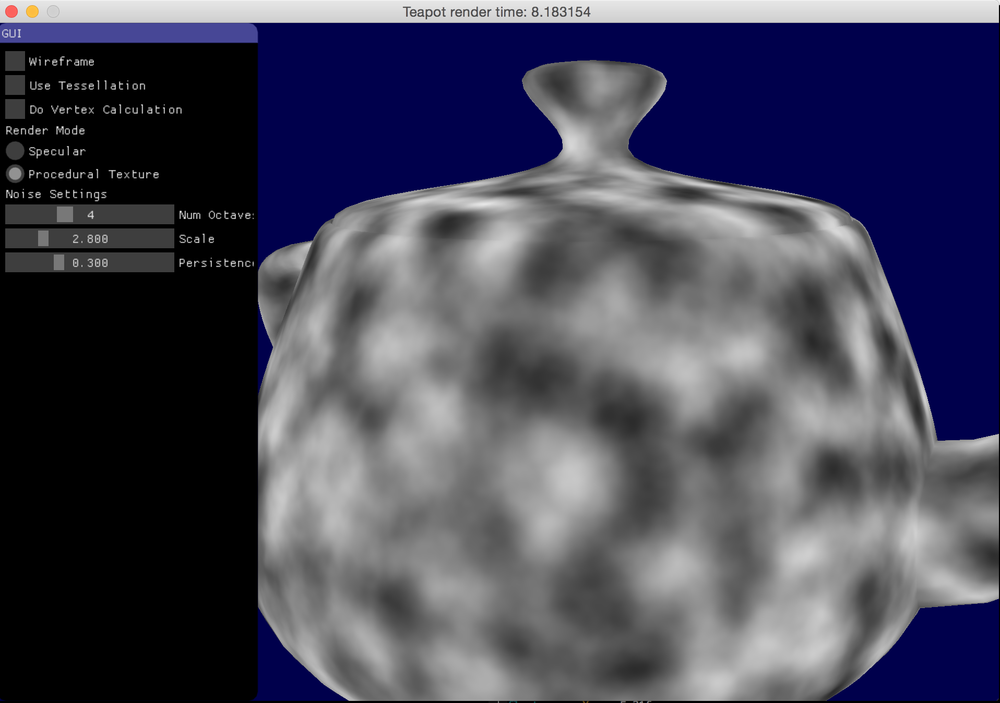

# Making Faster Fragment Shaders by Using Tessellation Shaders

Demonstration of how we can use tessellation shaders to make faster fragment shaders.

You can read the details in my [blog](https://erkaman.github.io/posts/tess_opt.html)



## GUI Usage

I will describe how to use the GUI.

* `Wireframe` check this checkbox to render the teapot in wireframe.
* `Do Vertex Calculation` check this checkbox to move the calculation(either specular lighting calculation or procedural texture calculation) from the fragment shader to the vertex shader
* `Use Tessellation` if checked, the calculation is moved from the fragment shader to the tessellation evaluation shader.
* `TessLevel` controls the tessellation level of the tessellation shader.
* `Render Mode` controls whether we are calculating specular lighting, or we are calculating a procedural texture on the teapot.

## Building

If on Linux or OS X, you can build it in the terminal by doing:

```
mkdir build && cmake .. && make
```

you can then launch the app by using the launch script:

```
./launch-tess_opt.sh
```

If on Windows, create a `build/` folder, and run `cmake ..` from
inside that folder. This will create a visual studio solution(if you
have visual studio). Launch that solution, and then choose to compile the
project named `tess_opt`.
